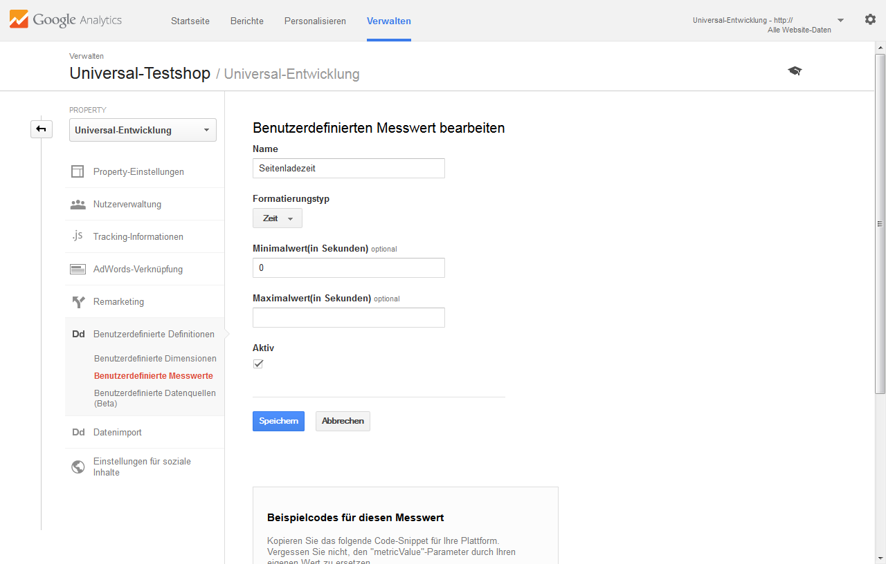

Werten Sie weitere kundenspezifische Daten aus, die über den Seitenbesuch hinausgehen. Im Standardmodul sind einige Dimensionen eingerichtet, deren Übertragung einfach im Adminbereich Ihres Shops aktiviert werden können.
Die Option finden Sie unter 
[ Admin ] -> [ (D3) Module ] -> [ {$menutitle} ] -> [ Einstellungen ] -> [ Analytics ] -> [ individuelle Daten ] -> [ individuelle Daten übertrage ].

Die Dimensionen müssen ebenfalls in Ihrem Google-Konto angelegt werden. Die erforderlichen Einstellungen entnehmen Sie bitte der folgenden Grafik. 
